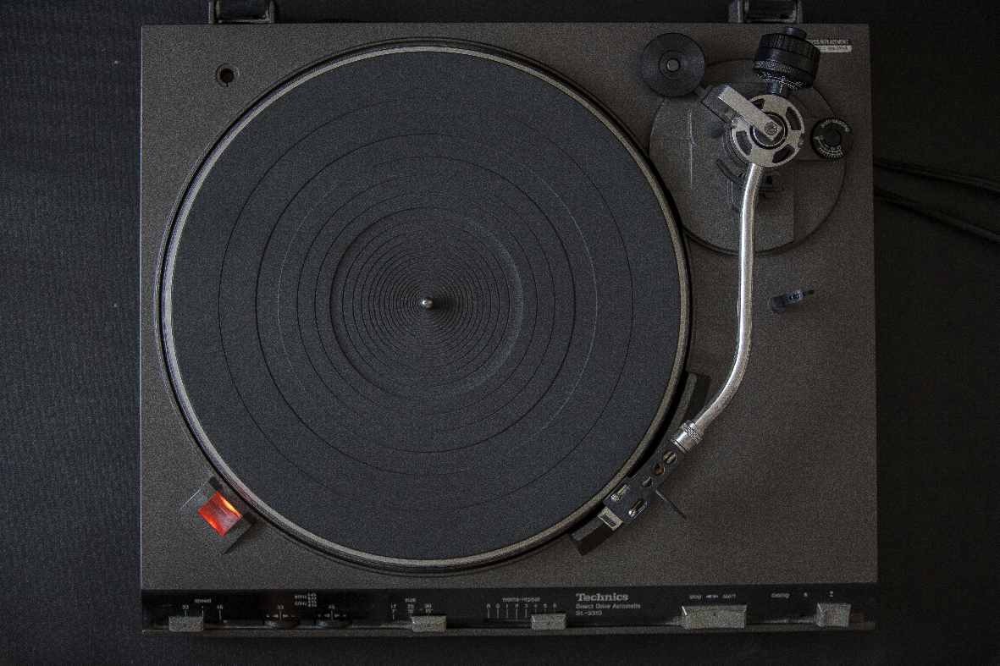

# AIA-Capstone-AlecPlante
# Spotify Data Exploration and Analysis 
By Alec Plante

## Using this Repo:
Hi y'all. There are many sections to this repo, so I tried to break it down for you:
- [Proposal](</Capstone Project Proposal Template.pdf>): original proposal for the project
- [Main Notebook](/index.ipynb)
- [Presentation](/Presentation.pptx): final Presentation for the project.
- [Data](/Data): data used for the project saved in CSV / TSV
- [Spotify API Request and Data Cleaning] (/SpotifyAPIRequestAndCleaning.ipynb)
- [Kworb Webscraping](/KworbScrape.ipynb): Data I scraped from Kworb, wikipedias streaming datasource 
- [Billboard Webscraping Function](/functions.py): functions I created and called in the index file to webscrape data from the Billboard Top 100 Charts
- [Images used for the project](/images)

The index file is where most of the **analysis** is done.
The **data is stored** in the data folder
The **data is obtained** through functions in the SpotifyAPIRequestAndCleaning, KworbScrape, and functions files
The unused code is in the unused folder. Interesting concepts and code lies in this folder, but its all unformatted. For later reference and ittertions of this project

## Overview:
Life Column Records is falling behind its competitors with the number of hit songs it produces and has asked us to figure out **what makes a hit song?** It will then communicate these findings to artists and implement the suggestions. In order to provide Life Column Records insight into the plan, the steps of the process have been organized below:

# Table of Contents
1. [Business Problem Definition](#part1)
2. [Data Understanding](#part2)
3. [Data Exploration](#part3)
4. [Data Modeling](#part4)
5. [Conclusion and Closing Thoughts](#part5)

## 1. Business Problem Definition 
Life Column Records is facing a significant business problem where they are falling behind their competitors in terms of producing hit songs. This problem could lead to a decrease in their market share and overall revenue. In order to address this issue, they have enlisted the help of our team to figure out what makes a hit song.

This business problem is multi-faceted and involves understanding the key factors that contribute to a song becoming a hit. There are several aspects to consider when analyzing the success of a song, including its melody, lyrics, composition, production, and overall marketability. To solve this problem, we will need to conduct extensive research and analysis to identify the common traits among the top-performing songs in the industry.

## 2. Data Understanding 

### Spotify API 
The Spotify API provides access to a range of audio features, metadata, analysis, and recommendation data. These features can be used to understand the musical characteristics of a song and its potential for success in the market. Here is a list of the features:
- **acousticness:** A confidence measure from 0.0 to 1.0 of whether the track is acoustic. 1.0 represents high confidence the track is acoustic.
- **analysis_url:** A URL to access the full audio analysis of this track. An access token is required to access this data.
- **danceability:** Danceability describes how suitable a track is for dancing based on a combination of musical elements including tempo, rhythm stability, beat strength, and overall regularity. A value of 0.0 is least danceable and 1.0 is most danceable.
- **duration_ms:** The duration of the track in milliseconds.
- **energy:** Energy is a measure from 0.0 to 1.0 and represents a perceptual measure of intensity and activity. Typically, energetic tracks feel fast, loud, and noisy. For example, death metal has high energy, while a Bach prelude scores low on the scale. Perceptual features contributing to this attribute include dynamic range, perceived loudness, timbre, onset rate, and general entropy.
- **id:** The Spotify ID for the track.
- **instrumentalness:** Predicts whether a track contains no vocals. "Ooh" and "aah" sounds are treated as instrumental in this context. Rap or spoken word tracks are clearly "vocal". The closer the instrumentalness value is to 1.0, the greater likelihood the track contains no vocal content. Values above 0.5 are intended to represent instrumental tracks, but confidence is higher as the value approaches 1.0.
- **key:** The key the track is in. Integers map to pitches using standard Pitch Class notation. E.g. 0 = C, 1 = C♯/D♭, 2 = D, and so on. If no key was detected, the value is -1.
- **liveness:** Detects the presence of an audience in the recording. Higher liveness values represent an increased probability that the track was performed live. A value above 0.8 provides strong likelihood that the track is live.
- **loudness:** The overall loudness of a track in decibels (dB). Loudness values are averaged across the entire track and are useful for comparing relative loudness of tracks. Loudness is the quality of a sound that is the primary psychological correlate of physical strength (amplitude). Values typically range between -60 and 0 db.
- **mode:** Mode indicates the modality (major or minor) of a track, the type of scale from which its melodic content is derived. Major is represented by 1 and minor is 0.
- **speechiness:** Speechiness detects the presence of spoken words in a track. The more exclusively speech-like the recording (e.g. talk show, audio book, poetry), the closer to 1.0 the attribute value. Values above 0.66 describe tracks that are probably made entirely of spoken words. Values between 0.33 and 0.66 describe tracks that may contain both music and speech, either in sections or layered, including such cases as rap music. Values below 0.33 most likely represent music and other non-speech-like tracks.
- **tempo:** The overall estimated tempo of a track in beats per minute (BPM). In musical terminology, tempo is the speed or pace of a given piece and derives directly from the average beat duration.
- **time_signature:** An estimated time signature. The time signature (meter) is a notational convention to specify how many beats are in each bar (or measure). The time signature ranges from 3 to 7 indicating time signatures of "3/4", to "7/4".
- **valence:** A measure from 0.0 to 1.0 describing the musical positiveness conveyed by a track. Tracks with high valence sound more positive (e.g. happy, cheerful, euphoric), while tracks with low valence sound more negative (e.g. sad, depressed, angry).

### Kworb.net
Kworb.net is a website that tracks the popularity and performance of various music platforms, including Spotify. The website provides a comprehensive overview of the total streams for songs and albums on Spotify.

The data on kworb.net about Spotify total streams is constantly updated and includes information on the total number of streams for individual songs, as well as for albums and artists. The website provides real-time data on the most popular songs and artists on Spotify, based on the number of streams they receive.

The columns included are:
- **Position**
- **Artist**
- **Title**
- **Weeks on chart**
- **Weeks being in top 10**, 
- **Peak Position**
- **(x?): number of weeks in top spot**
- **Peak streams for a week**
- **Total Streams**

### Billboard 
The Billboard Hot 100 is a weekly chart that ranks the top 100 songs in the United States across all genres based on a combination of radio airplay, streaming, and sales data. The chart is published by Billboard, a leading music industry publication.

The data used to compile the Billboard Hot 100 is collected by Nielsen SoundScan and Nielsen BDS, which track sales and airplay data from music retailers and radio stations across the United States. The data is then combined with streaming data from platforms such as YouTube, Spotify, and Apple Music to determine the ranking of each song.

Billboard Hot 100 data includes information such as the **song title, artist name, peak position on the chart, and number of weeks on the chart.** The chart also includes information on the **overall performance of each song, such as its current ranking compared to the previous week and any changes in its overall performance.**
This data has been processed mainly in the supporting files and only requires a bit of cleaning for this project.
## 3. Data Exploration 
This section shows the process of data exploration and the set up of the notebook.
The data to explore is the data listed above, which is billboard data, spotify data, and kworb data

## 4. Data Modeling and Evaluation 
A regression and some random forests were created to try to predict and discover information about the data

